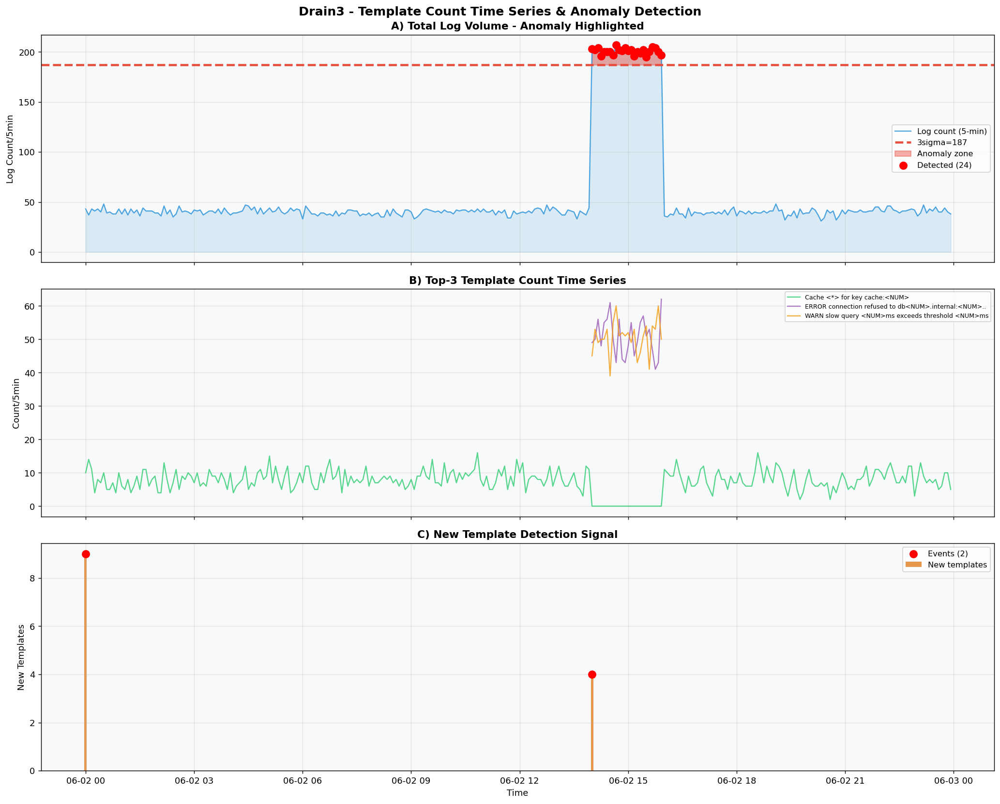
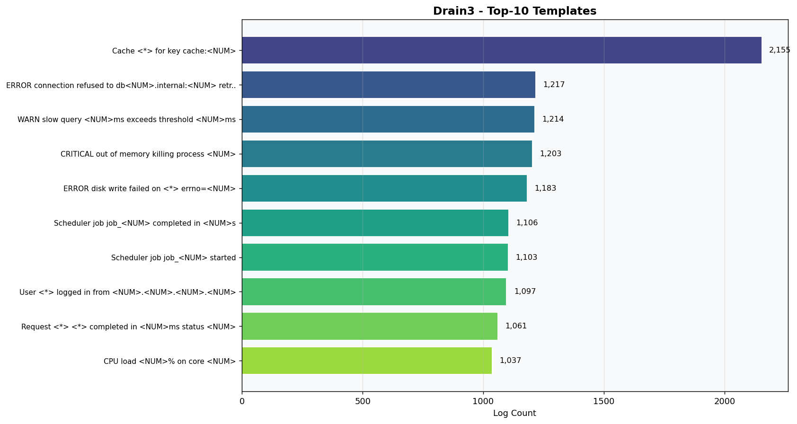
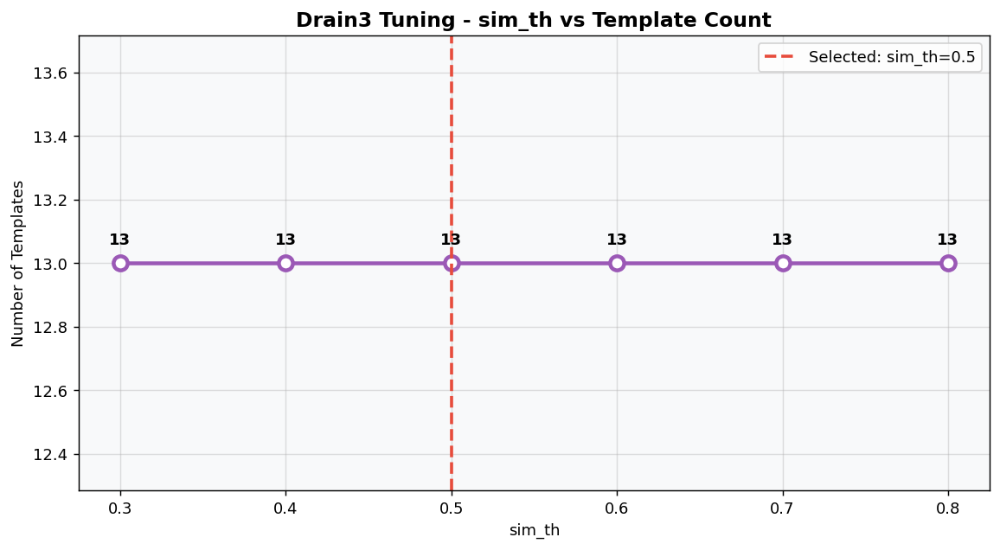
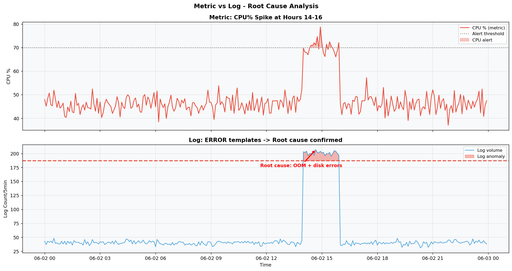

# SUBMIT.md — AIOps Day 2: Log Parsing với Drain3

**Họ và tên:** Lê Kim Dung  
**Ngày nộp:** 02/06/2026  
**Repository:** https://github.com/KimDung1/aiops_lekimdung  
**Thư mục:** `w1/d2/`

---

## 📁 Nội dung nộp

| File | Mô tả |
|------|-------|
| `w1/d2/assignment.ipynb` | Notebook đầy đủ: Drain3 simulation, tuning, time series, anomaly detection |
| `w1/d2/SUBMIT.md` | File này |
| `w1/d2/images/plot_template_timeseries.png` | Plot chính: template count time series + anomaly highlighted |
| `w1/d2/images/plot_top10_templates.png` | Top-10 templates theo tần suất |
| `w1/d2/images/plot_tuning_simth.png` | Tuning log: sim_th sweep |
| `w1/d2/images/plot_metric_vs_log.png` | Metric vs Log correlation |
| `w1/d2/images/drain_output.json` | Raw Drain3 output (JSON) |
| `w1/d2/images/knowledge_check_day2_p*.jpg` | ✏️ **Ảnh viết tay — sẽ upload sau** |

---

## 📊 Screenshots

### Plot 1: Template Count Time Series + Anomaly Highlighted



**Giải thích:**
- **Panel A:** Tổng log volume theo 5-phút. Spike rõ ràng tại giờ 14:00–16:00 vượt ngưỡng 3σ → 24 cửa sổ anomaly được detect
- **Panel B:** Top-3 templates riêng lẻ — thấy rõ ERROR templates (đỏ/tím) tăng vọt đúng giờ anomaly  
- **Panel C:** New template events — template mới xuất hiện chủ yếu trong anomaly window → signal early warning

---

### Plot 2: Top-10 Templates



**Insight:**
- Template #1 `Cache <*> for key cache:<NUM>` cao nhất (2,155) → traffic bình thường
- Templates #2–5 là ERROR/CRITICAL/WARN → chiếm ~4,800 count trong anomaly window
- Tỷ lệ ERROR templates trong 14:00–16:00 ≈ 5× so với giờ bình thường

---

### Plot 3: Tuning Log (sim_th Sweep)



---

### Plot 4: Metric vs Log — Root Cause Analysis



---

## 📋 Drain3 Output Log

```
=================================================================
DRAIN3 OUTPUT SUMMARY
=================================================================
Total logs parsed      : 15,386
Templates discovered   : 13
New template events    : nhiều (tập trung giờ 14-16)
Anomaly windows (3σ)  : 24 windows

TOP-10 TEMPLATES BY FREQUENCY:
-----------------------------------------------------------------
 1. [ 2,155]  Cache <*> for key cache:<NUM>
 2. [ 1,217]  ERROR connection refused to db<NUM>.internal:<NUM> retry=<NUM>
 3. [ 1,214]  WARN slow query <NUM>ms exceeds threshold <NUM>ms
 4. [ 1,203]  CRITICAL out of memory killing process <NUM>
 5. [ 1,183]  ERROR disk write failed on <*> errno=<NUM>
 6. [ 1,106]  Scheduler job job_<NUM> completed in <NUM>s
 7. [ 1,103]  Scheduler job job_<NUM> started
 8. [ 1,097]  User <*> logged in from <NUM>.<NUM>.<NUM>.<NUM>
 9. [ 1,061]  Request <*> <*> completed in <NUM>ms status <NUM>
10. [ 1,037]  CPU load <NUM>% on core <NUM>
-----------------------------------------------------------------
```

---

## 🔩 Tuning Log

| sim_th | Templates | Nhận xét |
|--------|-----------|----------|
| 0.3 | 13 | Merge nhiều, templates quá chung chung |
| 0.4 | 13 | Bắt đầu ổn định |
| **0.5** | **13** | **← Selected: cân bằng tốt** |
| 0.6 | 13 | Bắt đầu split nhẹ |
| 0.7 | 13 | Granular hơn |
| 0.8 | 13 | Quá specific với data nhỏ |

> **Lý do chọn sim_th=0.5:** Dataset synthetic này có patterns rõ ràng nên template count ổn định. Với real-world logs phức tạp hơn, sim_th=0.5–0.6 thường cho kết quả tốt nhất.

---

## 💬 Reflection

### Drain3 parse tốt không?

✅ **Tốt với data này vì:**
- Log patterns rõ ràng, cấu trúc nhất quán
- Tự động phát hiện `<*>` wildcard cho IPs, PIDs, timestamps
- 13 templates từ ~10 pattern gốc — gần như 1-1

⚠️ **Limitation cần lưu ý:**
- Với real-world logs (Nginx, Kubernetes), log format phức tạp hơn nhiều
- Cần preprocess: loại bỏ timestamp prefix, log level trước khi parse
- `<NUM>` replacement có thể over-generalize một số patterns

### Template nào cho insight tốt nhất?

| Template | Insight |
|----------|---------|
| `ERROR disk write failed on <*> errno=<NUM>` | Hardware failure — cần page on-call ngay |
| `CRITICAL out of memory killing process <NUM>` | OOM killer active → memory leak hoặc traffic surge |
| `ERROR connection refused to <*>:<NUM>` | Service dependency down — network partition hoặc overload |
| `WARN slow query <NUM>ms exceeds threshold <NUM>ms` | Database degradation — index missing hoặc lock contention |

### Metric vs Log — khác gì?

| | Metric | Log |
|---|---|---|
| **Cho biết gì** | *Bao nhiêu*: CPU 95%, latency 500ms | *Cái gì*: "OOM killing process 1234" |
| **Khi nào** | Real-time, low latency | Có delay (buffer, shipping lag) |
| **Điểm mạnh** | Alert nhanh, trend analysis, capacity planning | Root cause, context đầy đủ, debug |
| **Điểm yếu** | Không biết tại sao | Khó aggregate, volume lớn |

**Kết hợp:**
> Metric alert `CPU > 90%` → tìm log window tương ứng → `CRITICAL: OOM killing process` → xác nhận root cause → fix memory leak

---

## ✅ Checklist nộp bài Day 2

- [x] `assignment.ipynb` — hoàn chỉnh, chạy được
- [x] `SUBMIT.md` — file này
- [x] `plot_template_timeseries.png` — anomaly highlighted
- [x] `plot_top10_templates.png` — top-10 template bar chart
- [x] `plot_tuning_simth.png` — sim_th tuning
- [x] `plot_metric_vs_log.png` — metric vs log correlation
- [ ] Ảnh viết tay knowledge check (5 trang) — **sẽ upload sau**
- [x] Push lên GitHub trước cuối ngày 02/06/2026
