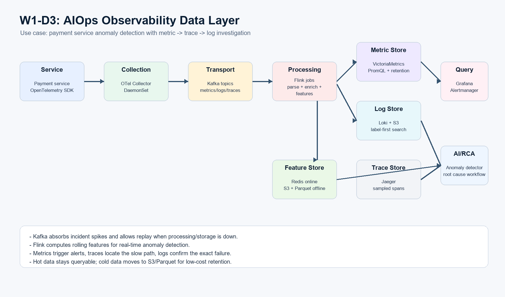
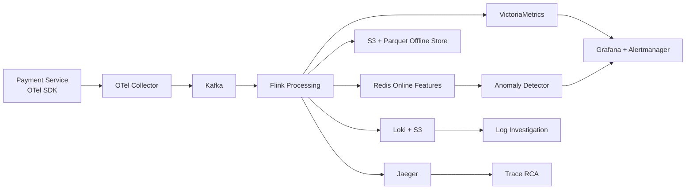

# SUBMIT.md - AIOps Day 3: Data Layer Architecture + Observability Pipeline

**Ho va ten:** Le Kim Dung  
**Ngay nop:** 03/06/2026  
**Repository:** https://github.com/KimDung1/aiops_lekimdung  
**Thu muc:** `w1/d3/`

---

## Noi Dung Nop

| File | Mo ta |
|---|---|
| `pipeline.py` | Mock streaming pipeline: producer doc CSV, consumer tinh rolling features, output `features.json` |
| `architecture.md` | So do E2E data layer cho payment service anomaly detection |
| `architecture.png` | Anh architecture diagram dung de nop bai |
| `generate_architecture_png.py` | Script sinh lai `architecture.png` neu can chinh sua |
| `cost_model.py` | Estimate monthly cost cho Small / Medium / Large va so sanh build vs buy |
| `ADR-001.md` | Architecture Decision Record: Kafka vs direct push |
| `features.json` | Output sau khi chay pipeline |

---

## Architecture Diagram





**Use case:** anomaly detection tren payment service. Metric dung de trigger alert, trace dung de tim service cham, log dung de xac nhan exact error/root cause.

---

## Pipeline Output

Script chay duoc bang:

```bash
uv run python pipeline.py
```

Neu may chua cai `uv`, co the chay truc tiep:

```bash
python pipeline.py
```

Neu chua co file NAB `realKnownCause/machine_temperature_system_failure.csv`, script tu tao deterministic synthetic CSV cung schema `timestamp,value`, sau do emit 22,695 rows vao `queue.Queue`, tinh:

- rolling mean 1h
- rolling std 1h
- rate of change
- z-score 1h
- anomaly signal voi nguong `abs(z_score) >= 3`

Output duoc ghi ra `features.json`.

Ket qua voi du lieu hien tai:

```text
Input rows emitted     : 22,695
Feature rows generated : 22,695
Anomaly signals        : 7
```

---

## Cost Estimate

| Tier | Services | Log/day | Metric eps | Build/month | Buy Datadog/month | Recommendation |
|---|---:|---:|---:|---:|---:|---|
| Small | 10 | 50 GB | 100,000 | $1,125 | $4,000 | Buy |
| Medium | 100 | 500 GB | 1,000,000 | $11,248 | $40,000 | Buy |
| Large | 1,000 | 5,000 GB | 10,000,000 | $112,475 | $400,000 | Build / hybrid |

Build stack re hon ve infra cost o scale lon, nhung can platform/SRE team van hanh. Buy Datadog dat hon nhung time-to-value nhanh va giam operational burden.

---

## ADR Summary

**Decision:** Dung Kafka giua OTel Collector va downstream processing/storage.

**Ly do:** Kafka decouple producer va consumer, co durable buffer, replay duoc khi Flink/Loki/VictoriaMetrics gap loi, va cho nhieu consumer doc cung mot telemetry stream.

**Trade-off quantified:**

- Latency tang khoang 5-20 ms
- Medium scale tang cost khoang $2,500/thang cho Kafka transport
- Doi lai giam risk mat telemetry khi incident spike hoac storage bi backpressure

---

## Reflection

Neu duoc hire lam Platform Engineer cho startup 50-service vua raise Series A, em se recommend **buy first, build selectively later**.

Ly do: 50 service chua du lon de justify team 2-3 SRE van hanh Kafka, Loki, VictoriaMetrics, Jaeger, Flink, schema registry va on-call rieng cho observability stack. Series A can ship nhanh, detect incident nhanh, va co dashboard/alert trong 1-2 tuan. Datadog/New Relic tuy dat hon infra self-host, nhung tiet kiem people time va giam risk platform non tre.

Tuy nhien, em van nen instrument bang OpenTelemetry ngay tu dau de tranh vendor lock-in. Log retention dai ngay co the day ve S3/Parquet rieng. Khi workload vuot 500+ service, cost SaaS tang manh, luc do co the hybrid: giu SaaS cho alert/APM quan trong, tu build storage/feature pipeline cho long-term analytics va ML.

---

## Checklist

- [x] `pipeline.py` mock streaming pipeline
- [x] `architecture.md` va `architecture.png` E2E data layer
- [x] `cost_model.py` cost model for 3 scale tiers
- [x] `ADR-001.md` theo format Michael Nygard
- [x] `SUBMIT.md` reflection
- [ ] Quiz 10 cau tren TAO Portal
