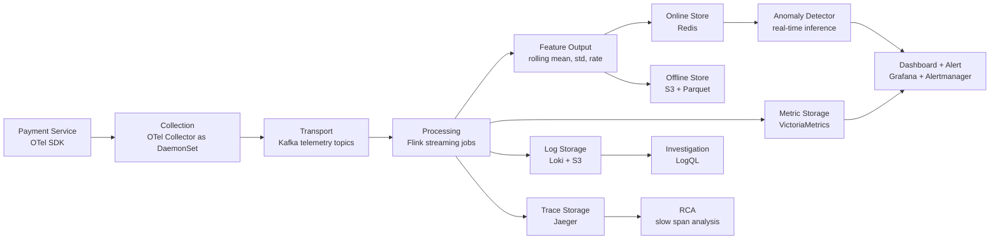

# W1-D3 Architecture: Payment Service Anomaly Detection

## Use Case

Detect abnormal latency, error rate, and dependency failures in a payment service. The system should alert quickly from metrics, then support root-cause investigation with traces and logs.

## End-to-End Data Layer

## Component Choices

| Stage | Tool | Reason |
|---|---|---|
| Service instrumentation | OpenTelemetry SDK | Vendor-neutral, one standard for metrics, logs, and traces |
| Collection | OTel Collector DaemonSet | Central place to enrich, batch, sample, and route telemetry |
| Transport | Kafka | Replay capability, backpressure handling, multiple consumers |
| Processing | Flink | Stateful rolling-window features and stream joins |
| Metric storage | VictoriaMetrics | Prometheus-compatible, cheaper long retention than single-node Prometheus |
| Log storage | Loki + S3 | Lower cost than Elasticsearch when label-first query is acceptable |
| Trace storage | Jaeger | Open-source trace backend, enough for sampled request investigation |
| Query / alert | Grafana + Alertmanager | Unified dashboard and production alert routing |
| ML features | Redis + S3/Parquet | Redis for online inference, S3 for offline training |

## Trade-Offs

Kafka adds around 5-20 ms latency and operational complexity, but it prevents telemetry loss when storage is slow or temporarily down. Loki is cheaper than Elasticsearch because it indexes labels instead of full text, but queries must start from good labels such as `service`, `env`, `level`, and `trace_id`. Flink is more complex than simple cron jobs, but it is justified because real-time anomaly detection needs rolling features with low latency.
